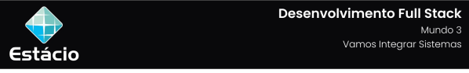

---

[Projeto](#-projeto) • [Como baixar e executar](#-como-baixar-e-executar) • [Procedimentos](#-procedimentos) • [Tecnologias utilizadas](#-tecnologias-utilizadas) • [Autor](#-autor) • [Licença](#-licença)

---

## 📋 Projeto

Missão Prática com o objetivo de desenvolver um sistema cadastral web utilizando Java, Servlets, JPA, EJB e Bootstrap para gerenciar produtos em um banco de dados SQL Server apresentado no **`Nível 4: Vamos integrar sistemas`** do **`Mundo 3`** do curso de **`Desenvolvimento Full Stack`** da **`Estácio`**, do semestre de **`2024.2`**, sob a tutoria de Jhonatan Alves.

Projeto elaborado de acordo com as diretrizes especificadas para a Missão Prática, que podem ser conferidas [**`clicando aqui`**](https://sway.cloud.microsoft/s/mFW7pht4vrv0SCQO/embed).

## 📥 Como baixar e executar

Para baixar os arquivos deste repositório, você deve ter o [GitHub](https://github.com/) instalado em seu dispositivo.

Além disso, faz-se necessário ter previamente instalado os softwares [SQL Server](https://www.microsoft.com/pt-br/sql-server/sql-server-downloads) e [SQL Server Management Studio](https://learn.microsoft.com/en-us/sql/ssms/download-sql-server-management-studio-ssms?view=sql-server-ver16#download-ssms), além de uma IDE para desenvolvimento em Java.

## 🔗 Procedimentos

Durante o projeto foram desenvolvidos 03 procedimentos descritos abaixo:

<table>
  <tr>
    <th>Procedimento</th>
    <th>Descrição</th>
  </tr>
  <tr>
    <td>Camadas de persistência e controle</td>
    <td>
      <ul>
        <li>Configuração da conexão com SQL Server via NetBeans.</li>
        <li>Criação de projetos Java Enterprise no NetBeans.</li>
        <li>Definição das camadas de persistência e controle usando JPA e EJB.</li>
      </ul>
    </td>
  </tr>
  <tr>
    <td> Interface cadastral com Servlet e JSPs</td>
    <td>
      <ul>
        <li>Implementação de um Servlet de controle seguindo o padrão Front Controller.</li>
        <li>Criação de páginas JSP para listar e cadastrar produtos.</li>
        <li>Interação entre o Servlet e as páginas JSP para inclusão, alteração, exclusão e listagem de produtos.</li>
      </ul>
    </td>
  </tr>
  <tr>
    <td>Melhorando o design da interface</td>
    <td>
      <ul>
        <li>Inclusão das bibliotecas do Bootstrap nas páginas JSP.</li>
        <li>Modificação do código HTML e CSS para aplicar estilos fornecidos pelo Bootstrap, melhorando a aparência e a usabilidade das páginas.</li>
      </ul>
    </td>
  </tr>
</table>

Para acessar o relatório da Missão Prática, clique no botão abaixo:

## 🛠 Tecnologias utilizadas

Para a construção e execução do projeto foram utilizadas as seguintes tecnologias:

   

## 👥 Autor

| Aluno                                                  | Matrícula    | E-mail                                      |
| ------------------------------------------------------ | ------------ | ------------------------------------------- |
| [GUSTAVO CALIL](https://github.com/gustavocalil-github) | 202304625751 | [📧](mailto:202304625751@alunos.estacio.br) |

## 📃 Licença

Este repositório está licensiado sob a [Licença MIT](./LICENSE).

